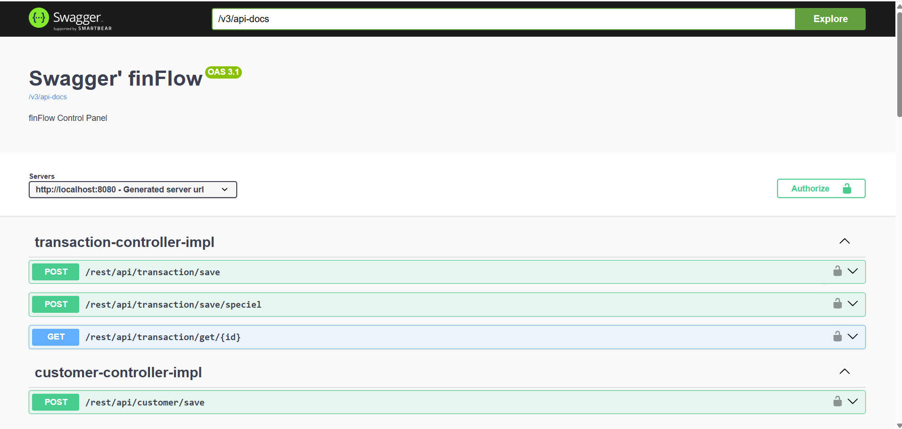

# FinFlow

## ER Diagram

 
 
----------

## Swagger

FinFlow is a RESTful banking application with a layered architecture developed using Java 17 and Spring Boot. Within the project, user authentication and authorization processes are provided through a JWT-based security structure, and account, card, and basic banking transactions (money transfers, deposits, and withdrawals) are performed securely. Data is stored in a PostgreSQL database, while persistent data management is provided using JPA/Hibernate. Furthermore, real-time exchange rate information is obtained from an external currency exchange service, enabling automatic conversion of amounts in transfers between different currencies and their accurate reflection in the recipient's account. The `@transactionel` annotation was professionally implemented during these stages. The project utilizes Swagger for API documentation, global exception handling, request validation, and a layered service structure to create a sustainable and scalable backend architecture.

Prerequisites and Installation

You need to obtain an API key from the TCMB EVDS system.
Create a Secret Key that conforms to the HS256 algorithm for JWT validation.
Before running the application, ensure that you have correctly filled in the relevant fields in the application.properties file.

Prepared by Arda Demirtas.
